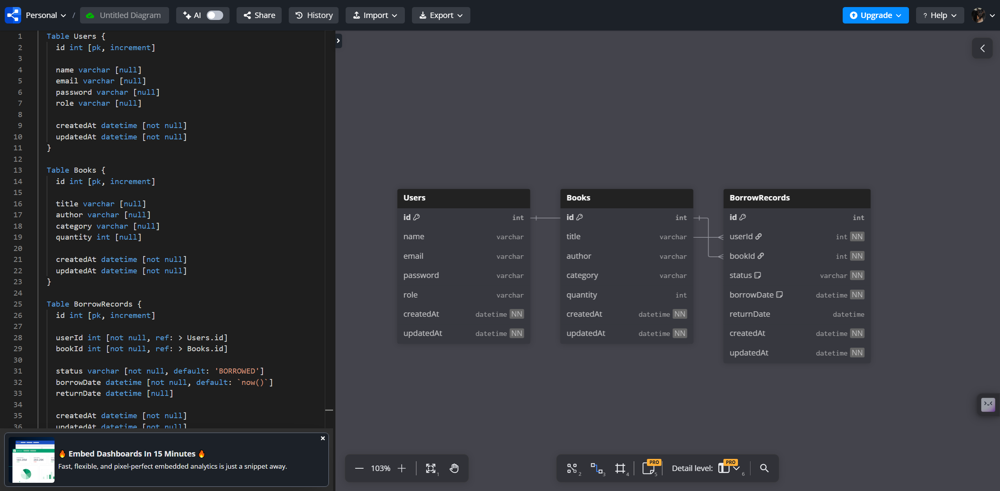
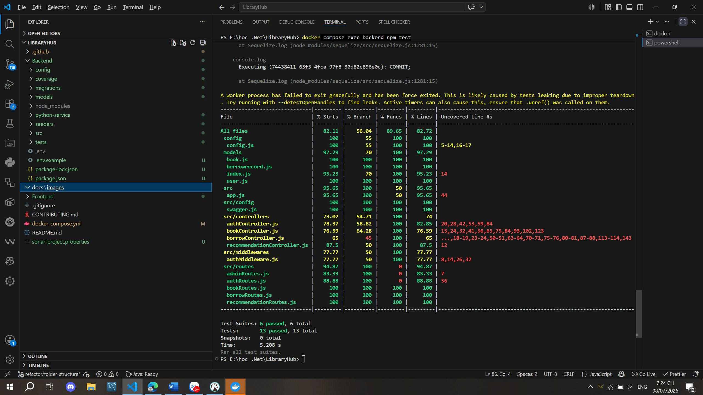
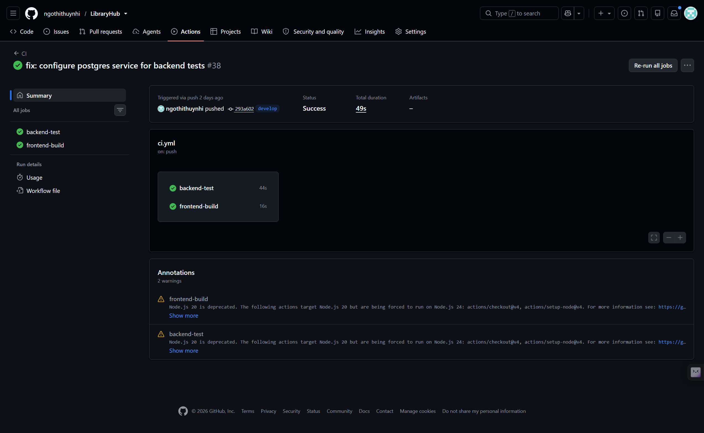
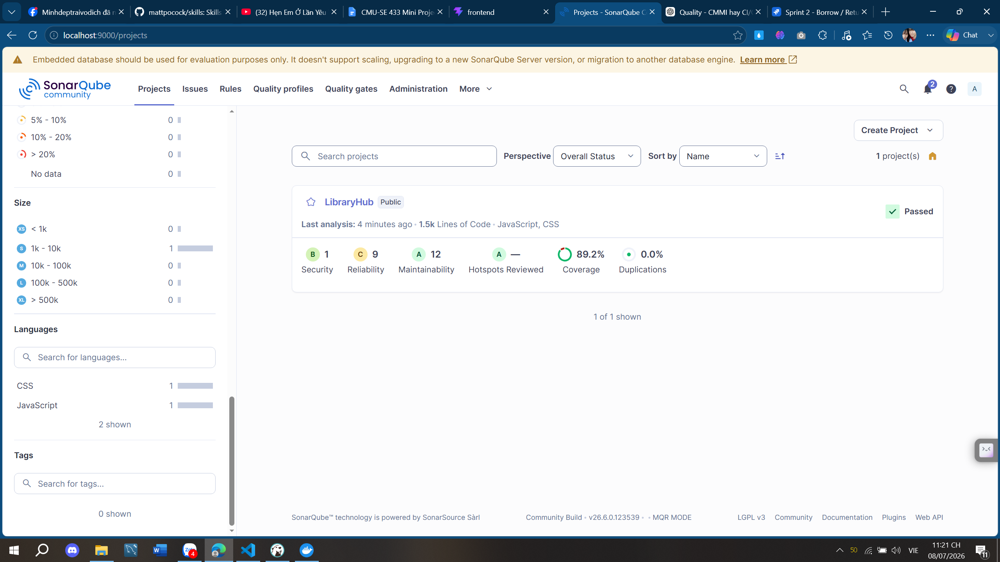
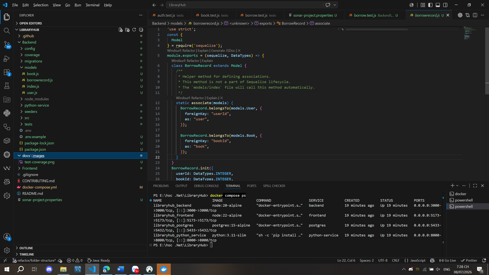
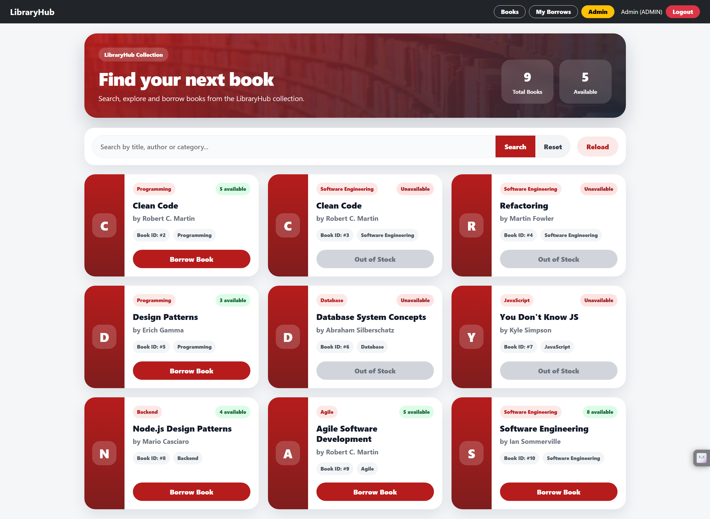
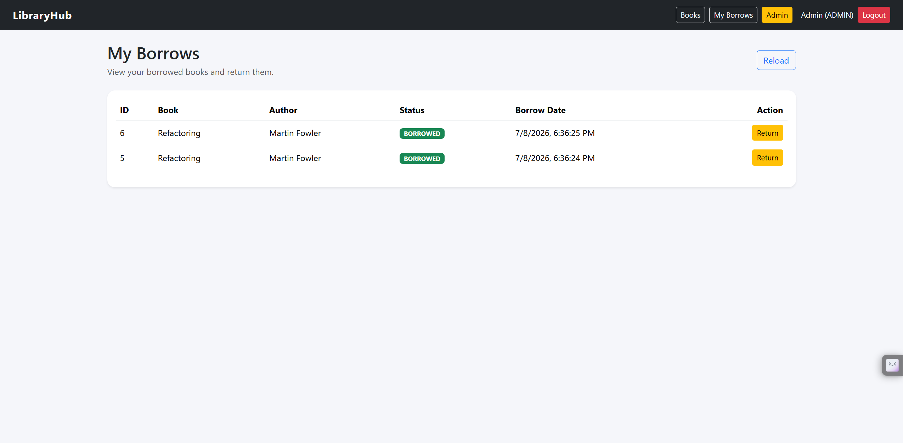
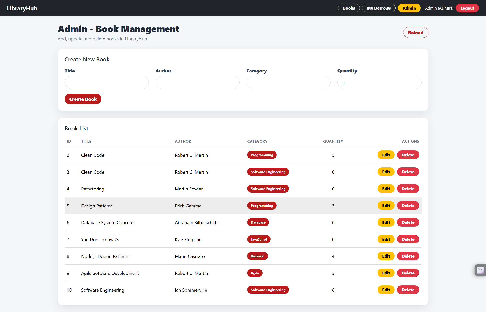
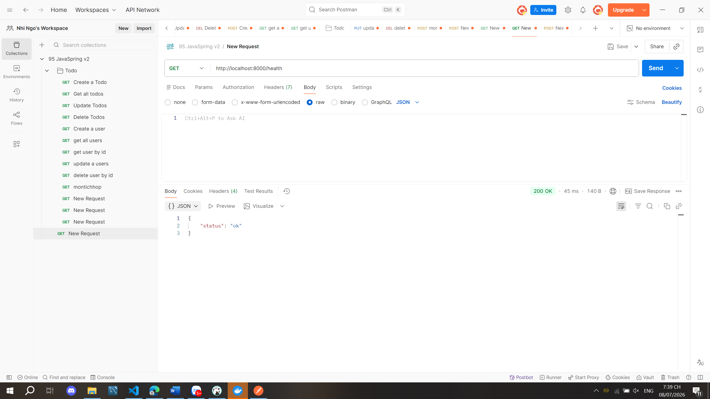
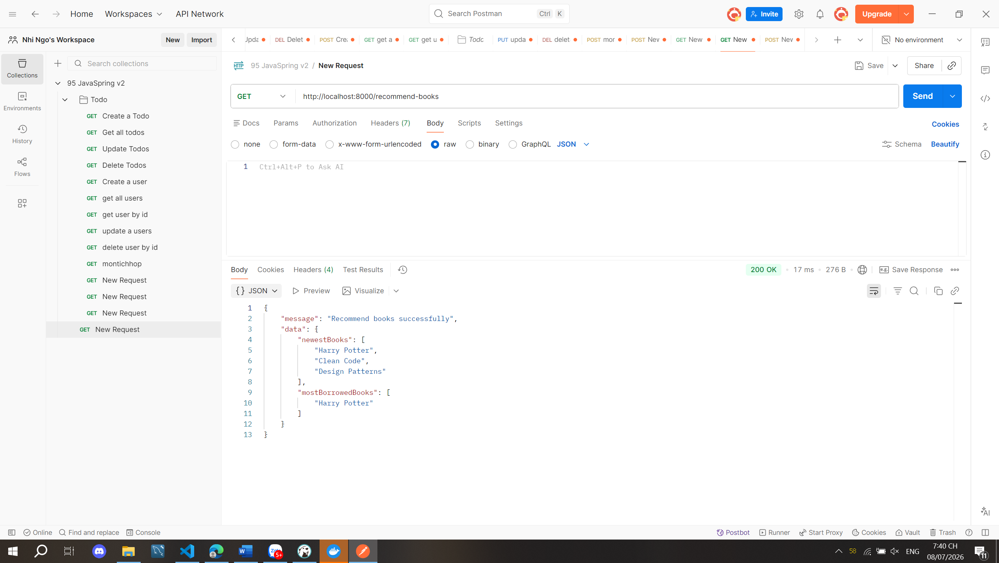

# LibraryHub - SPQM Mini Project

## 1. Project Description

**LibraryHub** is a library management web application developed for the **CMU-SE 433 Software Process & Quality Management Mini Project**.

The system supports two main roles:

- **User**: register, login, view books, search books, borrow books, view borrow history, and return books.
- **Admin**: manage books, including create, update, and delete book information.

The project targets **Level 2** and applies a **CMMI Level 2-oriented process improvement approach**. Quality is measured through GitHub Actions, Jest/Supertest coverage, SonarQube analysis, Docker evidence, ERD/database evidence, and SPQM process documentation.

---

## 2. Target Level 2 Requirements

| Requirement | Project Evidence |
|---|---|
| Node.js + Express backend | Backend REST API |
| PostgreSQL database | Users, Books, BorrowRecords tables |
| JWT Authentication | Register/Login with JWT token |
| Authorization | Admin = 1, User = 2 |
| Complete business workflow | Search, Borrow, Return, Borrow History |
| Python FastAPI service | `/health`, `/recommend-books` |
| Docker Compose | Backend, Frontend, PostgreSQL, Python service |
| GitHub Actions CI | Backend test + Frontend build passed |
| SonarQube | Code quality dashboard and coverage |
| Testing coverage ≥ 80% | Jest line coverage 92.46% |

---

## 3. Main Features

- JWT authentication and authorization
- Role-based access control: **Admin = 1**, **User = 2**
- Book listing and searching
- Borrow and return book workflow with user-selected expected return date / due date visibility
- Borrow history page
- Admin book management
- Admin dashboard statistics
- Informational overdue fine calculation
- Mock overdue reminder generation without SMTP
- PostgreSQL database with Sequelize ORM
- Python FastAPI recommendation service
- Docker Compose multi-service environment
- GitHub Actions CI pipeline
- Jest + Supertest integration testing
- SonarQube code quality analysis
- SPQM/CMMI process evidence

---

### 3.1 Advanced Demo Features

- **Admin Dashboard**: admins can view total users, books, book copies, borrow records, active borrows, returned borrows, overdue records, and estimated informational fines.
- **Overdue Fine Calculation**: borrow records include a nullable due date and an informational fine amount. Users can select an expected return date when borrowing. The due date must be between tomorrow and 14 days from the borrow date, and late returns calculate `overdueDays * 5000` from the selected due date.
- **Mock Overdue Reminder**: admins can generate simulated overdue reminder messages for overdue borrow records. Demo overdue records can be created with the seed data. No real email, SMTP, payment, fine payment, or external sending is used.

---

## 4. Technology Stack

| Layer | Technology |
|---|---|
| Frontend | Vue 3, Vite, Bootstrap, Axios |
| Backend | Node.js, Express.js |
| Database | PostgreSQL |
| ORM | Sequelize |
| Authentication | JWT |
| Python Service | FastAPI |
| Testing | Jest, Supertest |
| Quality Analysis | SonarQube |
| DevOps | Docker Compose, GitHub Actions |
| Process Model | Agile Scrum, PDCA, ODA, CMMI Level 2 |

---

## 5. System Architecture

```txt
User Browser
    |
    v
Vue 3 Frontend
    |
    v
Node.js Express Backend
    |
    +------------------> PostgreSQL Database
    |
    +------------------> Python FastAPI Recommendation Service
```

---

## 6. Project Structure

```txt
LibraryHub/
├── Backend/
│   ├── src/
│   │   ├── controllers/
│   │   ├── routes/
│   │   ├── middlewares/
│   │   └── config/
│   ├── models/
│   ├── migrations/
│   ├── seeders/
│   ├── tests/
│   └── python-service/
├── Frontend/
│   └── src/
├── docs/
│   └── images/
├── .github/
│   └── workflows/
├── docker-compose.yml
├── sonar-project.properties
├── CONTRIBUTING.md
└── README.md
```

---

## 7. How to Run

### 7.1 Clone Repository

```powershell
git clone https://github.com/ngothithuynhi/LibraryHub.git
cd LibraryHub
git checkout develop
```

---

### 7.2 Create Backend Environment File

The `.env` file is not pushed to GitHub. Create it from the example file:

```powershell
Copy-Item Backend\.env.example Backend\.env
```

Expected environment values:

```env
PORT=3000

DB_HOST=postgres
DB_PORT=5432
DB_USER=root
DB_PASSWORD=123456
DB_NAME=libraryhub
DB_NAME_TEST=libraryhub_test

JWT_SECRET=secret

PYTHON_SERVICE=http://python-service:8000
```

---

### 7.3 Start Docker Services

```powershell
docker compose up --build -d
```

Check running containers:

```powershell
docker compose ps
```

Expected services:

```txt
libraryhub_backend
libraryhub_frontend
libraryhub_postgres
libraryhub_python_service
```

---

### 7.4 Run Database Migration

Main database:

```powershell
docker compose exec backend npx sequelize-cli db:migrate
```

Test database:

```powershell
docker compose exec backend npx sequelize-cli db:migrate --env test
```

---

### 7.5 Run Seeder

```powershell
docker compose exec backend npx sequelize-cli db:seed:all
```

The seeder includes demo overdue borrow records for the Mock Overdue Reminders page.

Demo overdue users:

| Email | Password |
|---|---|
| overdue.user@libraryhub.com | 123456 |
| overdue.user.2@libraryhub.com | 123456 |

If seed data already exists and needs to be reset:

```powershell
docker compose exec backend npx sequelize-cli db:seed:undo:all
docker compose exec backend npx sequelize-cli db:seed:all
```

---

### 7.6 Access URLs

| Service | URL |
|---|---|
| Frontend | http://localhost:5173 |
| Backend API | http://localhost:3000 |
| FastAPI Health | http://localhost:8000/health |
| FastAPI Recommendation | http://localhost:8000/recommend-books |
| Swagger API Docs | http://localhost:3000/api-docs |

---

## 8. Database

### 8.1 Database Tables

The system uses PostgreSQL with three main tables:

- `Users`
- `Books`
- `BorrowRecords`

Relationship:

```txt
Users.id 1 ---- * BorrowRecords.userId
Books.id 1 ---- * BorrowRecords.bookId
```

`BorrowRecords` also stores `dueDate` and `fineAmount` for informational overdue tracking. Existing records are migration-safe because `dueDate` is nullable and `fineAmount` defaults to 0.

### 8.2 ERD



### 8.3 DBeaver Connection

Use this configuration to connect to PostgreSQL from DBeaver:

| Field | Value |
|---|---|
| Host | 127.0.0.1 |
| Port | 5433 |
| Database | libraryhub |
| Username | root |
| Password | 123456 |

For test database:

| Field | Value |
|---|---|
| Database | libraryhub_test |

---

## 9. API Summary

### Authentication

| Method | Endpoint | Description |
|---|---|---|
| POST | `/api/auth/register` | Register new user |
| POST | `/api/auth/login` | Login and receive JWT token |

### Books

| Method | Endpoint | Description |
|---|---|---|
| GET | `/api/books` | Get all books |
| GET | `/api/books/:id` | Get book detail |
| GET | `/api/books/search?keyword=...` | Search books by title, author, or category |
| POST | `/api/books` | Create book, admin only |
| PUT | `/api/books/:id` | Update book, admin only |
| DELETE | `/api/books/:id` | Delete book, admin only |

### Borrow / Return

| Method | Endpoint | Description |
|---|---|---|
| POST | `/api/borrow` | Borrow a book with an optional selected due date and receive the due date in the response |
| POST | `/api/borrow/return` | Return a borrowed book |
| GET | `/api/borrow/history` | View user's borrow history with due date and informational fine data |

### Admin

| Method | Endpoint | Description |
|---|---|---|
| GET | `/api/admin/dashboard/stats` | View admin dashboard statistics, admin only |
| GET | `/api/admin/reminders/overdue` | Generate mock overdue reminder messages, admin only |
| GET | `/api/admin/users` | View users, admin only |
| PATCH | `/api/admin/users/:id/role` | Update editable user role, admin only |

### Recommendation

| Method | Endpoint | Description |
|---|---|---|
| GET | `/api/recommendations` | Express API calling FastAPI recommendation service |
| GET | `http://localhost:8000/health` | FastAPI health check |
| GET | `http://localhost:8000/recommend-books` | FastAPI book recommendation |

---

## 10. Testing and Coverage

The backend uses **Jest + Supertest** with a real PostgreSQL test database. The tests are integration tests because they call the real Express application and use Sequelize with the `libraryhub_test` PostgreSQL database.

### Run Tests

```powershell
docker compose exec backend npm test
```

### Latest Test Result

| Metric | Result |
|---|---:|
| Test Suites | 8 passed / 8 total |
| Tests | 47 passed / 47 total |
| Statement Coverage | 91.4% |
| Branch Coverage | 79.27% |
| Function Coverage | 97.36% |
| Line Coverage | 92.46% |



---

## 11. GitHub Actions CI

GitHub Actions is used to verify the project before merging.

CI jobs:

| Job | Purpose | Status |
|---|---|---|
| backend-test | Run backend Jest/Supertest tests with PostgreSQL service | Passed |
| frontend-build | Build Vue frontend | Passed |



---

## 12. SonarQube Result

SonarQube is used to measure code quality, maintainability, reliability, duplication, and coverage.

| Metric | Result |
|---|---:|
| Quality Gate | Passed |
| SonarQube Coverage | 89.2% |
| Duplications | 0.0% |
| Maintainability | A |
| Reliability | C |
| Security | B |



> Note: SonarQube is used as Level 2 code quality evidence. The team also uses Jest/Supertest coverage to verify that backend testing coverage is above 80%.

---

## 13. SPQM Process

The project applies the SPQM requirements through six main parts.

### 13.1 Define and Design Process

The team follows Agile Scrum with PDCA and ODA improvement thinking.

```txt
Plan → Implement → Test → Measure → Improve
```

### 13.2 Plan and Prioritize

The team manages work using prioritized backlog items:

| Priority | Work Item |
|---|---|
| P0 | Authentication, Book CRUD, Borrow/Return |
| P1 | Search, FastAPI recommendation, Docker, CI |
| P2 | UI polish, screenshots, README, report |

### 13.3 Change Management

The team uses Git workflow and Pull Request review:

```txt
main → develop → feature/* → Pull Request → Review → Merge
```

Commit convention:

```txt
feat: add new feature
fix: fix bug
test: add or update tests
docs: update documentation
chore: update configuration
```

Definition of Done:

```txt
Code completed
Tests passed
Coverage >= 80%
Pull Request reviewed
GitHub Actions passed
SonarQube checked
Documentation updated
```

### 13.4 Measurement

Main quality metrics:

| Metric | Baseline | Final Result | Target |
|---|---:|---:|---:|
| Test Count | 0 | 47 passed | Increase |
| Line Coverage | 0% | 92.46% | >= 80% |
| SonarQube Coverage | N/A | 89.2% | >= 80% |
| Duplication | N/A | 0.0% | < 3% |
| GitHub Actions | Failed initially | Passed | Passed |
| Critical Defects | Several during development | 0 open critical defects | Reduce |

### 13.5 Process Assessment

The team performs CMMI self-assessment and selects:

```txt
CMMI Level 2 - Repeatable
```

Main evidence:

| Process Area | Evidence |
|---|---|
| Requirements Management | Backlog, README, Jira/GitHub tasks |
| Project Planning | Sprint plan, ProjectPlan, task assignment |
| Configuration Management | Git branches, PR review, CONTRIBUTING.md |
| Measurement and Analysis | Coverage, test count, CI result, SonarQube |
| Quality Assurance | Jest, Supertest, SonarQube |
| Verification and Validation | API testing, frontend testing, Docker evidence |

### 13.6 Improvement and Summary

Sprint retrospectives were used to identify problems and improvement actions.

| Sprint | Problem | Improvement Action |
|---|---|---|
| Sprint 1 | Test environment unstable | Standardized Docker and database setup |
| Sprint 2 | Borrow/Return needed transaction checks | Added integration tests and rollback checks |
| Sprint 3 | Coverage and role mismatch issues | Added edge-case tests and standardized roles |
| Sprint 4 | Evidence and CI needed final verification | Updated README, screenshots, CI, and Sonar evidence |

---

## 14. CMMI Level 2 Evidence

| Practice Area | Project Evidence |
|---|---|
| Requirements Management | Feature list, backlog, README |
| Project Planning | Sprint tasks and priorities |
| Project Monitoring | GitHub Actions, SonarQube, screenshots |
| Measurement and Analysis | Coverage, test count, duplication, quality gate |
| Quality Assurance | Jest tests, Supertest integration tests, SonarQube |
| Configuration Management | Git, Docker Compose, README, CONTRIBUTING.md |

---

## 15. Screenshots

### Docker Running



### ERD


### GitHub Actions Passed


### Test Coverage


### SonarQube Dashboard


### Book List



### My Borrow Records



### Admin Book Management



### FastAPI Health



### FastAPI Recommendation



---

## 16. Demo Video

Demo video link:

```txt
https://drive.google.com/drive/folders/1un_nK-LNHOmjL34hgzdJKFwHu2_mlQKw?usp=sharing
```

The demo video shows:

- Running the application
- User register/login
- Book list and search
- Borrow and return workflow
- Admin book management
- FastAPI service
- GitHub Actions pipeline
- SonarQube quality dashboard

---

## 17. Repository

GitHub repository:

```txt
https://github.com/ngothithuynhi/LibraryHub.git
```

---

## 18. Conclusion

LibraryHub demonstrates a complete **Level 2 Software Process and Quality Management project** with a working full-stack system, PostgreSQL database, Docker Compose environment, Python FastAPI service, GitHub Actions CI, integration testing, SonarQube quality analysis, ERD evidence, and SPQM/CMMI process documentation.
